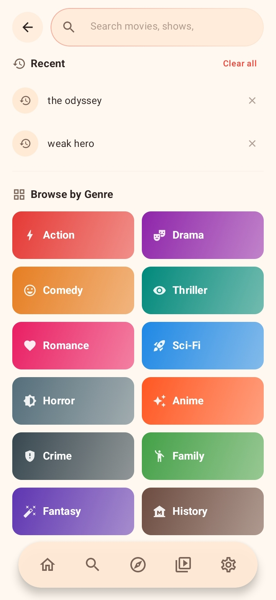
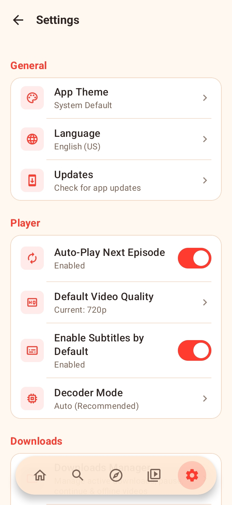

<p align="center">
  
</p>
<h1 align="center">CineTheta</h1>

<p align="center">
  <strong>A sleek, modern, multi-provider video streaming & downloading app for Android.</strong>
</p>

## ✨ Features

- 🎬 **Multi-Provider Scraping:** Automatically aggregates streams from various providers (MovieBox, NetMirror, etc.) to ensure the highest quality links.
- ⚡ **Native Player:** Seamless playback experience with advanced controls, built on ExoPlayer/Media3.
- 📥 **Background Downloading:** Download your favorite movies and episodes directly to your device (`Downloads/CineTheta`) with auto-resume support.
- 🎨 **Modern UI:** A beautiful, buttery-smooth user interface built entirely with Jetpack Compose and Material 3.
- 🔄 **In-App Updater:** Stay up-to-date with seamless, OTA (Over-The-Air) automatic updates directly from GitHub Releases.
- 🚫 **No Ads:** Completely ad-free, uninterrupted streaming experience.

## 📸 Screenshots

<table align="center">
  <tr>
    <td align="center"><b>Home Page (Dark)</b></td>
    <td align="center"><b>Home Page (Light)</b></td>
  </tr>
  <tr>
    <td></td>
    <td></td>
  </tr>
  <tr>
    <td align="center"><b>Premium Details (Dark)</b></td>
    <td align="center"><b>Premium Details (Light)</b></td>
  </tr>
  <tr>
    <td></td>
    <td></td>
  </tr>
  <tr>
    <td align="center"><b>Search & Filters (Dark)</b></td>
    <td align="center"><b>Search & Filters (Light)</b></td>
  </tr>
  <tr>
    <td></td>
    <td></td>
  </tr>
  <tr>
    <td align="center"><b>Native Video Player</b></td>
    <td align="center"><b>Multi-Audio & Subs Selection</b></td>
  </tr>
  <tr>
    <td></td>
    <td></td>
  </tr>
  <tr>
    <td align="center"><b>Downloads (Dark)</b></td>
    <td align="center"><b>Settings (Light)</b></td>
  </tr>
  <tr>
    <td></td>
    <td></td>
  </tr>
</table>

## 🛠️ Tech Stack

- **Language:** [Kotlin](https://kotlinlang.org/)
- **UI Toolkit:** [Jetpack Compose](https://developer.android.com/jetpack/compose)
- **Architecture:** MVVM (Model-View-ViewModel)
- **Networking:** [OkHttp](https://square.github.io/okhttp/) & [Retrofit](https://square.github.io/retrofit/)
- **Media Playback:** [AndroidX Media3 (ExoPlayer)](https://developer.android.com/media/media3)
- **Dependency Injection:** [Hilt](https://dagger.dev/hilt/)

## 🚀 Getting Started

### Prerequisites
- Android Studio (Latest Stable Version)
- Android SDK API Level 24+ (Android 7.0+)

### Build Instructions
1. Clone the repository:
   ```bash
   git clone https://github.com/yourusername/CineTheta.git
   ```
2. Open the project in Android Studio.
3. Sync Gradle and hit **Run** (`Shift + F10`).

## 💖 Support the Project

If you love **CineTheta** and want to support ongoing server maintenance, provider scraping fixes, and new features, consider donating:

| Method | Details | Network / Note |
| :--- | :--- | :--- |
| 🟡 **Binance Pay** | `1041683310` | Instant, 0% fees |
| 🟢 **USDT** | `TJEbUfurBzdNhFARk6STdzNKAKpuQR5g6j` | **Tron (TRC-20)** |

*Every bit of support helps keep CineTheta active, open-source, and ad-free!*

## ⚖️ Disclaimer

**CineTheta** is purely a client-side application. It does not host, store, or distribute any copyrighted media files. The app acts merely as a search tool and media player that scrapes public websites. The developers of CineTheta have no affiliation with the content providers and take no responsibility for the content accessed through the application. Use this software responsibly and in accordance with your local laws.

## 🤝 Contributing

Pull requests are welcome! If you'd like to add a new provider or fix a bug:
1. Fork the repository.
2. Create your feature branch (`git checkout -b feature/NewProvider`).
3. Commit your changes (`git commit -m 'Add some feature'`).
4. Push to the branch (`git push origin feature/NewProvider`).
5. Open a Pull Request.

---
<p align="center">Made with ❤️ for the open-source community.</p>
